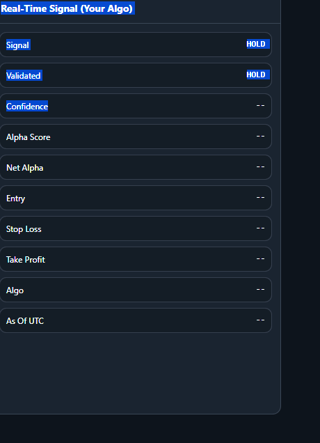

# QuantTrader — Institutional-Grade Quantitative Trading System

> A 15-layer, multi-asset quantitative trading system for Indian equities (NSE), US equities (NYSE/NASDAQ), and Forex. Features an 8-factor IC-weighted alpha model, ML ensemble (XGBoost + LightGBM + Ridge + LSTM + **Transformer**), 5-state HMM regime detection, Almgren-Chriss transaction cost modelling, Hierarchical Risk Parity portfolio optimisation, synthetic order-book microstructure alpha, Optuna Bayesian hyperparameter tuning, async parallel execution, paper-to-live capital validation framework, and real execution adapters (Paper / Zerodha Kite / ICICI Breeze).

---

## Architecture (15 Layers)

```
┌──────────────────────────────────────────────────────────────────────────┐
│                          main.py  (entry point)                          │
│       --mode  live | dashboard | signals | backtest | capacity           │
│       --engine wfo | full                                                │
└─────────────────────────────┬────────────────────────────────────────────┘
                              │
        ┌─────────────────────┼─────────────────────┐
        ▼                     ▼                     ▼
   LiveRunner            FastAPI              BacktestEngine
  (APScheduler)         Dashboard            CapacitySimulator
        │                                      WFOValidator
  ┌─────┴────────────────────────────┐
  │  Intraday (every 5 min)          │
  │  EOD     (after market close)    │
  │  Watchdog (every 1 min)          │
  └─────┬────────────────────────────┘
        │
 ┌── L1 — DATA INGESTION ────────────────────────────────────────────┐
 │  MarketDataConnector (yfinance + Alpha Vantage Forex)             │
 │  AltDataProvider (FII/DII, NSE PCR, Google Trends)                │
 │  UniverseManager (survivorship-bias-free point-in-time snapshots) │
 └───────────────────┬───────────────────────────────────────────────┘
                     │
 ┌── L2 — DATA QUALITY GATE ─────────────────────────────────────────┐
 │  DataAnomalyDetector (stale bars, spikes, zero volume, NaN fill)  │
 │  SecondaryPriceValidator (Polygon, Alpaca, AlphaVantage cross-val)│
 │  → Severe anomalies suppress the asset for the cycle              │
 └───────────────────┬───────────────────────────────────────────────┘
                     │
 ┌── L3 — FEATURE ENGINEERING ──────────────────────────────────────┐
 │  FeatureEngineer (30+ indicators + rolling beta)                 │
 │  + ADF Stationarity Enforcement (auto-differences non-stationary)│
 │  + Microstructure Proxies (Corwin-Schultz spread, Amihud, OI)    │
 │  + LOB Order Flow (OFI, VPIN, Kyle's Lambda, Micro-Price)  [NEW] │
 │  + Hurst Exponent (R/S analysis)                                 │
 └───────────────────┬──────────────────────────────────────────────┘
                     │
 ┌── L4 — LOOKAHEAD AUDIT ──────────────────────────────────────────┐
 │  LookaheadBiasAuditor — blocks features that leak future data    │
 └───────────────────┬──────────────────────────────────────────────┘
                     │
 ┌── L5 — ALPHA / FACTOR MODEL (8-FACTOR) ──────────────────────────┐
 │  AlphaFactorModel: 8-factor IC-weighted + Hurst modifier         │
 │  CrossSectionalRanker: AQR-style 60% CS + 40% TS blend           │
 │  FactorDecayMonitor: auto-zero dead factors (IC₂₁ < −0.05)       │
 │  MetaModel: regime-adaptive factor weighting (TRENDING/CRISIS/…) │
 │  F8 — Microstructure (OFI + VPIN + Kyle Lambda + Micro-Price)    │
 └───────────────────┬──────────────────────────────────────────────┘
                     │
 ┌── L6 — ML ENSEMBLE + TRANSFORMER ────────────────────────────────┐
 │  EnsembleModel: XGBoost + LightGBM + Ridge stacking              │
 │    OOT validation → negative-IC models get weight = 0            │
 │    Walk-forward meta-learner refit + SHAP feature importance      │
 │  TrendPredictionModel: LSTM with MC Dropout (F4)                 │
 │  TemporalAttentionModel: 2-layer Transformer (causal mask) [NEW] │
 │    Sinusoidal positional encoding + MC Dropout uncertainty        │
 │  Combined ML score = average of LSTM + Ensemble + Transformer    │
 │  Optuna Bayesian tuning (TPE) for hyperparameters          [NEW] │
 └───────────────────┬──────────────────────────────────────────────┘
                     │
 ┌── L7 — REGIME DETECTION ─────────────────────────────────────────┐
 │  5-state GaussianHMM (HIGH_VOL_BULL, BULL, SIDEWAYS, BEAR,       │
 │                        HIGH_VOL_BEAR)                             │
 │  7 emission features: log return, vol₂₀, volume ratio,          │
 │    ATR percentile, VIX-Z, DXY momentum, yield spread             │
 │  Online update every 5 intraday cycles                            │
 │  Persisted to data/hmm_{asset_class}.pkl                         │
 └───────────────────┬──────────────────────────────────────────────┘
                     │
 ┌── L8 — SIGNAL ENGINE ────────────────────────────────────────────┐
 │  SignalEngine: ATR-based SL/TP, net-alpha cost gate              │
 │  CostModel: Almgren-Chriss (slippage + spread + √-law impact)    │
 │    Regime-aware spread widening (SIDEWAYS 1.5×, low-liq 2.0×)    │
 │    Self-calibrating η from realised fills                        │
 └───────────────────┬──────────────────────────────────────────────┘
                     │
 ┌── L9 — RISK MANAGEMENT ──────────────────────────────────────────┐
 │  KellyCalculator: regime-aware quarter-Kelly, cold-start 2%      │
 │  PortfolioRiskGuard:                                             │
 │    Drawdown circuit breaker (−5%), max 8 positions                │
 │    VaR gate (3%) + CVaR gate (4%)                                │
 │    Class exposure caps (IN 40%, US 40%, FX 20%)                  │
 │    Correlation filter (0.7, tightened to 0.5 in BEAR regimes)    │
 │    Factor crowding detection (60% threshold → halve)             │
 │  HRPOptimizer: Ledoit-Wolf shrinkage + Ward-linkage HRP          │
 │  HistoricalStressTester: gate cached in EOD flow                 │
 └───────────────────┬──────────────────────────────────────────────┘
                     │
 ┌── L10 — EXPECTED RETURNS (Returns-First) ────────────────────────┐
 │  ExpectedReturns: α × confidence → vol-scaled, regime-adjusted,  │
 │    Bayesian-shrunk annualised return forecasts                    │
 └───────────────────┬──────────────────────────────────────────────┘
                     │
 ┌── L11 — EXECUTION ───────────────────────────────────────────────┐
 │  PaperTrader: simulated fills + random slippage                  │
 │  ZerodhaExecutor: Kite bracket orders (LIMIT + SL + TP)          │
 │  BreezeExecutor: ICICI Breeze stub (dry-run without credentials) │
 │  ExecutionSimulator: latency sim, Almgren-Chriss impact, GBM     │
 │  AsyncExecutionPipeline: parallel per-asset processing     [NEW] │
 │    ThreadPoolExecutor + latency instrumentation + feature cache   │
 │  OrderStateRecord: persistent state machine (7 states)            │
 │  FillReconciler: slippage-overrun detection                      │
 │  ImpactCalibrator: recalibrate η from realised fills             │
 └───────────────────┬──────────────────────────────────────────────┘
                     │
 ┌── L12 — PERSISTENCE & STORE ─────────────────────────────────────┐
 │  SignalStore (SQLAlchemy → SQLite / Postgres):                    │
 │    signals, portfolio snapshots, orders, order events,            │
 │    reconciliation events, data quality events,                    │
 │    model validation records, system health events                 │
 └───────────────────┬──────────────────────────────────────────────┘
                     │
 ┌── L13 — RESEARCH & VALIDATION ───────────────────────────────────┐
 │  ResearchValidator: Deflated Sharpe Ratio (DSR) + PBO (CSCV)     │
 │  WFOValidator: walk-forward IC/IR optimisation                    │
 │  OptunaEnsembleTuner: Bayesian hyperparameter search       [NEW] │
 │  OptunaAlphaTuner: Bayesian alpha_threshold/ic_window      [NEW] │
 │  LookaheadBiasAuditor: future-leak check on engineered features  │
 │  HistoricalStressTester: crisis-window survivability gate         │
 └───────────────────┬──────────────────────────────────────────────┘
                     │
 ┌── L14 — CAPITAL VALIDATION ──────────────────────────────────────┐
 │  PaperToLiveGraduator: 5-stage capital ramp              [NEW]   │
 │    Paper Validation → 10% → 25% → 50% → 100%                    │
 │    KS-test divergence detection + drawdown circuit breaker        │
 │  LivePerformanceTracker: running Sharpe/DD vs paper        [NEW] │
 │  Position reconciliation (internal vs broker) after every cycle   │
 │  SchedulerHealthWatchdog: heartbeat monitoring, alert cooldown    │
 │  NotificationManager: Telegram + email alerting                   │
 └───────────────────┬──────────────────────────────────────────────┘
                     │
 ┌── L15 — DASHBOARD ───────────────────────────────────────────────┐
 │  FastAPI + WebSocket (real-time signal push)                      │
 │  Command Center UI: 7 tabs (Overview, Signals, Portfolio,        │
 │    Factor Analysis, Regime, Health, History)                      │
 │  JWT auth middleware (optional, configurable)                     │
 │  /api/health, /api/live-validation, /api/latency                 │
 └──────────────────────────────────────────────────────────────────┘
```

---

## Quick Start

### 1. Install Dependencies

```bash
cd Trading
pip install -r requirements.txt
```

> **Optional packages**: `tensorflow` (LSTM + Transformer), `xgboost` / `lightgbm` (ensemble), `shap` (feature importance), `PyJWT` (dashboard auth), `optuna` (Bayesian tuning), `kiteconnect` (Zerodha live execution). The system degrades gracefully without any of these.

### 2. Environment Variables

Create a `.env` file in the project root:

```env
ALPHA_VANTAGE_KEY=your_key         # required for Forex EOD
NSE_COOKIE=                        # optional, NSE live scraper
ZERODHA_API_KEY=                   # optional, live Zerodha execution
ZERODHA_ACCESS_TOKEN=              # optional, live Zerodha execution
```

### 3. Run Modes

| Command | Description |
|---|---|
| `python main.py --mode live` | Full system: scheduler + dashboard + execution |
| `python main.py --mode dashboard` | Dashboard only (read-only, no data fetching) |
| `python main.py --mode signals` | Terminal signal output only (no web UI) |
| `python main.py --mode backtest --engine wfo --ticker AAPL` | Walk-Forward IC/IR validation |
| `python main.py --mode backtest --engine full --ticker AAPL` | Event-driven PnL backtest with fills + slippage |
| `python main.py --mode capacity --ticker RELIANCE.NS` | Single-ticker AUM capacity decay (₹10L → ₹100Cr) |
| `python main.py --mode capacity --ticker ALL` | Watchlist-level capacity analysis |

---

## Watchlist Coverage

| Market | Assets | Examples |
|---|---|---|
| **Indian Equities (NSE)** | 25 | RELIANCE, INFY, TCS, HDFCBANK, SBIN, LT, ITC, BHARTIARTL, KOTAKBANK, BAJFINANCE, MARUTI, TITAN, … |
| **US Equities** | 20+ | AAPL, MSFT, GOOGL, NVDA, TSLA, AMZN, META, AMD, NFLX, JPM, GS, SPY, QQQ, IWM, TLT, … |
| **Forex** | 5 | EURUSD, GBPUSD, USDINR, USDJPY, XAUUSD |

---

## Alpha Model (8 Factors)

| Factor | Description | Hurst Modifier |
|---|---|---|
| **F1 — Momentum** | IC-weighted multi-period ROC (1d/5d/20d/60d) | ×1.25 if H > 0.55 |
| **F2 — Mean Reversion** | Negated Z-score of Close vs SMA₂₀ | ×1.25 if H < 0.45 |
| **F3 — Volume** | OBV slope + CMF + Volume Oscillator | — |
| **F4 — ML α (LSTM)** | LSTM directional score with MC Dropout | — |
| **F5 — Vol/Squeeze** | Keltner Squeeze breakout + ATR percentile | — |
| **F6 — Alt Data** | FII/DII flow + NIFTY PCR + Google Trends | Indian stocks only |
| **F7 — Ensemble ML** | XGBoost + LightGBM + Ridge meta-learner | OOT-validated |
| **F8 — Microstructure** | OFI + VPIN + Kyle's Lambda + Micro-Price | — |

**Scoring**: `α = Σ(IC_i × Z_i) / max(Σ|IC_i|, 0.1)` with decay-monitored IC weights  
**Blend**: `final = 0.60 × CS_rank + 0.40 × tanh(TS_alpha)`  
**Meta-Model**: regime-adaptive factor weighting — TRENDING boosts momentum 1.5×, CRISIS scales all down 0.4×

---

## Microstructure Alpha (F8) — Order Book Module

Since real L2 feeds are prohibitively expensive, the system builds a **synthetic order book** from OHLCV + volume:

| Feature | Source | Description |
|---|---|---|
| **OFI** | Cont, Kukanov & Stoikov (2014) | Order Flow Imbalance — buy vs sell volume pressure via tick rule |
| **VPIN** | Easley, López de Prado & O'Hara (2012) | Volume-synchronised probability of informed trading |
| **Kyle's Lambda** | Kyle (1985) | Price impact per unit of signed order flow |
| **Trade Arrival** | — | Poisson intensity of trade direction changes |
| **Micro-Price** | — | Volume-weighted fair value offset from mid-price |

The `SyntheticOrderBook` generates L2 snapshots with power-law depth decay, Corwin-Schultz spread estimation, and close-position-weighted buy/sell asymmetry.

---

## ML Pipeline (Triple Model)

### Ensemble Model (XGBoost + LightGBM + Ridge)
- Out-of-Time (OOT) validation: last N days withheld
- Automatic weight zeroing: models with negative OOT IC get weight = 0
- Walk-forward meta refit with TimeSeriesSplit
- SHAP feature importance tracking

### LSTM (TrendPredictionModel)
- MC Dropout for uncertainty estimation
- Auto-retrains only when OOT accuracy drops below 52%

### Transformer (TemporalAttentionModel) — **NEW**
- 2-layer multi-head self-attention with **causal masking** (no future leakage)
- Sinusoidal positional encoding (captures temporal structure)
- MC Dropout at inference provides uncertainty estimates
- Global average pooling → dense → tanh → [-1, +1]
- OOT accuracy gate: down-weighted if < 52%

**Combined score** = average of all trained models (LSTM + Ensemble + Transformer)

### Bayesian Hyperparameter Tuning (Optuna) — **NEW**
- TPE (Tree-structured Parzen Estimator) search over XGB/LGB/Ridge params
- Walk-forward OOS IC as objective, MedianPruner for early stopping
- Studies persisted to `data/optuna_study.db` (resume across sessions)
- `OptunaAlphaTuner`: replaces grid search for WFO alpha_threshold + ic_window

---

## Regime Detection (5-State HMM)

| State | Signal Filter | Position Size |
|---|---|---|
| **BULL** | BUY only | 100% |
| **HIGH_VOL_BULL** | BUY if STRONG or MODERATE | 70% |
| **SIDEWAYS** | STRONG signals only | 50% |
| **BEAR** | SELL only | 100% |
| **HIGH_VOL_BEAR** | SELL if STRONG or MODERATE | 70% |

---

## Risk Management Pipeline

```
Signal pipeline (in order):
  1. Data Quality Gate:     stale/spike/NaN → suppress asset for cycle
  2. Secondary Validation:  daily close cross-checked against alternate source
  3. Lookahead Audit:       blocks features with future data leakage
  4. Factor Decay Gate:     IC₂₁ < −0.05 AND IC₆₃ < 0 → factor weight → 0
  5. Cost Gate:             net_alpha ≤ 0 → discard (Almgren-Chriss)
  6. Stress Test Gate:      strategy must survive 2+ historical crises
  7. Drawdown CB:           daily PnL ≤ −5% → halt all signals
  8. Max positions:         ≤ 8 open simultaneously
  9. VaR limit:             portfolio 95% VaR ≤ 3%
 10. CVaR limit:            portfolio 95% CVaR ≤ 4%
 11. Duplicate block:       one open position per asset max
 12. Class exposure:        Indian ≤ 40%, US ≤ 40%, Forex ≤ 20%
 13. Correlation filter:    |corr| > 0.7 (tightened to 0.5 in BEAR regimes)
 14. Factor crowding:       > 60% same-direction → halve position
 15. Regime signal gate:    BULL → BUY only, BEAR → SELL only, etc.
 16. Kelly sizing:          regime-aware quarter-Kelly (25%), cold-start 2%
 17. HRP allocation:        Ledoit-Wolf + Ward linkage, per-asset weight caps
```

---

## Paper → Live Capital Validation — **NEW**

Statistical framework for graduating from paper trading to live deployment:

| Stage | Capital | Requirements |
|---|---|---|
| **Paper Validation** | 0% | 30+ days, Sharpe > 1.0, t-test p < 0.10 |
| **Seed Capital** | 10% | 14+ days, Sharpe > 0.8, DD < 5% |
| **Quarter Capital** | 25% | 21+ days, Sharpe > 0.6, DD < 7% |
| **Half Capital** | 50% | 21+ days, Sharpe > 0.5, DD < 8% |
| **Full Capital** | 100% | No ongoing requirements |

**Safety mechanisms**:
- **KS-test divergence**: if paper and live return distributions differ significantly → retreat one stage
- **Drawdown circuit breaker**: exceeding stage-specific DD limit → automatic retreat
- **Sharpe divergence**: if live Sharpe deviates from paper by > 2σ → retreat

---

## Async Execution Pipeline — **NEW**

Reduces end-to-end signal latency by processing assets concurrently:

- **ThreadPoolExecutor**: parallel data fetch, feature computation, and signal generation (configurable `max_workers`, default 4)
- **LatencyReport**: per-cycle breakdown — `data_fetch_ms`, `feature_compute_ms`, `alpha_score_ms`, `execution_ms`
- **FeatureCache**: warm cache with TTL between intraday cycles (avoids redundant computation)
- **ConnectionPool**: pre-authenticated broker API sessions

---

## Execution Engine

| Broker | Features | Status |
|---|---|---|
| **PaperTrader** | Simulated fills, random slippage, in-memory positions | ✅ Ready |
| **ZerodhaExecutor** | Kite Connect bracket orders (LIMIT + SL trigger + TP) | ✅ Ready (needs API keys) |
| **BreezeExecutor** | ICICI Breeze stub — dry-run without credentials | ✅ Ready |

---

## Dashboard

Access at **http://127.0.0.1:8000** after `--mode live` or `--mode dashboard`.

**API Endpoints** (17 routes):

| Endpoint | Description |
|---|---|
| `GET /api/signals` | Latest signals |
| `GET /api/portfolio` | Portfolio metrics + equity curve |
| `GET /api/history` | Signal history with filters |
| `GET /api/factors` | Factor scores + IC weights + decay status |
| `GET /api/regime` | Current regime per asset class |
| `GET /api/snapshot` | Latest portfolio snapshot |
| `GET /api/health` | System health: Sharpe decay, drawdown, circuit breaker |
| `GET /api/orders` | Order lifecycle records |
| `GET /api/data-quality` | Data anomaly events |
| `GET /api/reconciliation` | Fill reconciliation events |
| `GET /api/model-validation` | ML model OOT validation records |
| `GET /api/system-health` | System health log events |
| `GET /api/live-validation` | Paper→Live graduation status + performance (**NEW**) |
| `GET /api/latency` | Async pipeline latency breakdown (**NEW**) |
| `POST /auth/token` | JWT token issuance (when auth enabled) |
| `WS /ws` | Real-time signal push via WebSocket |

---

## Project Structure

```
Trading/
├── main.py                               # Entry point, mode routing
├── config.yaml                           # All tunable parameters (~450 lines)
├── requirements.txt                      # 28 dependencies
├── .env                                  # API keys (not committed)
├── data/
│   ├── signals.db                        # SQLite database (auto-created)
│   ├── hmm_indian_stock.pkl              # Persisted HMM models
│   └── optuna_study.db                   # Optuna Bayesian tuning studies
├── src/
│   ├── api/
│   │   ├── connectors.py                 # yfinance + Alpha Vantage + NSE
│   │   ├── rate_limiter.py               # Token-bucket + TTL cache
│   │   ├── alt_data.py                   # FII/DII + NSE PCR + Google Trends
│   │   ├── data_quality.py               # DataAnomalyDetector + SecondaryPriceValidator
│   │   └── universe_manager.py           # Point-in-time universe snapshots
│   ├── features/
│   │   ├── engineer.py                   # 30+ indicators + stationarity + orderflow [MODIFIED]
│   │   └── hurst.py                      # Hurst exponent (R/S analysis)
│   ├── alpha/
│   │   ├── factor_model.py               # 8-factor IC-weighted alpha [MODIFIED]
│   │   ├── regime.py                     # 5-state GaussianHMM + online update
│   │   ├── cross_sectional.py            # AQR-style CS rank blending
│   │   ├── decay_monitor.py              # Factor IC decay tracker
│   │   ├── meta_model.py                 # Regime-adaptive factor weighting
│   │   └── orderbook.py                  # SyntheticOrderBook + OrderFlowAnalyser [NEW]
│   ├── signals/
│   │   ├── engine.py                     # Signal generation + net-alpha gate
│   │   └── store.py                      # SQLAlchemy persistence (8 tables)
│   ├── risk/
│   │   ├── kelly.py                      # Kelly + PortfolioRiskGuard (VaR/CVaR/corr/crowding)
│   │   ├── portfolio.py                  # PortfolioTracker + metrics
│   │   ├── cost_model.py                 # Almgren-Chriss + regime spread adjustment
│   │   ├── optimizer.py                  # Ledoit-Wolf + HRP
│   │   └── scenario.py                   # Scenario analysis utilities
│   ├── models/
│   │   ├── ensemble_model.py             # XGB + LGB + Ridge + OOT + SHAP
│   │   ├── trend_model.py                # LSTM with MC Dropout
│   │   └── attention_model.py            # Transformer (causal mask + MC Dropout) [NEW]
│   ├── portfolio/
│   │   └── expected_returns.py           # Returns-first portfolio construction
│   ├── execution/
│   │   ├── broker.py                     # PaperTrader + Zerodha + Breeze + factory
│   │   ├── simulator.py                  # Latency + Almgren-Chriss impact + GBM ticks
│   │   ├── reconciliation.py             # FillReconciler + ImpactCalibrator
│   │   ├── state_machine.py              # OrderStateRecord (7-state lifecycle)
│   │   └── async_executor.py             # AsyncExecutionPipeline + FeatureCache [NEW]
│   ├── research/
│   │   ├── validation.py                 # DSR + PBO (CSCV) overfitting defense
│   │   ├── lookahead.py                  # Lookahead bias auditor
│   │   ├── stress.py                     # Historical stress-test gate
│   │   ├── hyperparam.py                 # Optuna Bayesian tuning [NEW]
│   │   └── capital_validation.py         # Paper→Live graduation framework [NEW]
│   ├── backtest/
│   │   ├── engine.py                     # Event-driven backtester
│   │   └── capacity.py                   # AUM capacity decay + watchlist mode
│   ├── scheduler/
│   │   ├── live_runner.py                # APScheduler orchestration [MODIFIED]
│   │   └── watchdog.py                   # SchedulerHealthWatchdog
│   ├── dashboard/
│   │   ├── api.py                        # FastAPI + JWT + 17 routes + WebSocket [MODIFIED]
│   │   └── static/index.html             # Command Center UI (7 tabs)
│   ├── utils/
│   │   ├── math_utils.py                 # Sharpe, Sortino, Calmar, VaR, IR
│   │   ├── alerts.py                     # Desktop notifications + sound
│   │   └── notifiers.py                  # Telegram + email alerting
│   └── validator.py                      # Walk-Forward Optimisation (WFO)
└── docs/
    └── superpowers/specs/                # PRD / design docs
```

---

## Configuration Reference (`config.yaml`)

| Section | Key Parameters |
|---|---|
| `watchlist` | 25 Indian stocks, 20+ US stocks, 5 Forex pairs |
| `signal` | `alpha_score_threshold: 0.30`, `ic_window: 60` |
| `risk` | `max_drawdown: 5%`, `max_positions: 8`, `var_limit: 3%`, `cvar_limit: 4%` |
| `cost_model` | `impact_coeff: 0.6`, per-class half-spreads, regime/liquidity multipliers |
| `optimizer` | `lookback: 60d`, `max_position: 5%`, `shrinkage: ledoit_wolf` |
| `execution` | `broker: paper/zerodha/breeze`, `max_slippage_multiple: 2.0` |
| `database` | `url: data/signals.db` (SQLite) or Postgres connection string |
| `data_quality` | `stale_bars: 3`, `spike_sigma: 5.0` |
| `secondary_validation` | Polygon / Alpaca / AlphaVantage API keys for cross-validation |
| `watchdog` | `intraday_expected_min: 7`, `alert_cooldown_min: 30` |
| `notifications` | Telegram bot token + email SMTP config |
| `ml_validation` | `oot_days: 10`, `lstm_min_oot_accuracy: 0.52` |
| `regime` | `n_states: 5` |
| `ensemble` | `retrain_days: 21`, `n_estimators: 200`, `forward_horizon: 5` |
| `dashboard` | `host: 127.0.0.1`, `port: 8000`, JWT auth config |
| `expected_returns` | `vol_target: 0.12`, `shrinkage: 0.3`, `horizon_days: 5` |
| `execution_sim` | Latency range, permanent/temporary impact coefficients |
| `meta_model` | `momentum_smoothing: 0.7` |
| `crowding` | `threshold_class: 0.6`, `threshold_global: 0.75` |
| `research` | `dsr_significance: 0.05`, `pbo_max: 0.5`, `pbo_partitions: 10` |
| `capacity` | AUM levels: ₹10L → ₹10Cr |
| `attention_model` | `seq_len: 60`, `d_model: 64`, `n_heads: 4`, `n_layers: 2` (**NEW**) |
| `async` | `max_workers: 4` (**NEW**) |
| `capital_validation` | 5-stage ramp, `min_paper_sharpe: 1.0`, `divergence_sigma: 2.0` (**NEW**) |
| `optuna` | `ensemble_trials: 50`, `timeout_sec: 600`, `db_path: data/optuna_study.db` (**NEW**) |

---

## Data & Persistence

Default: **SQLite** at `data/signals.db`. Set `database.url` to a Postgres connection string if needed.

| Table | Content |
|---|---|
| `signals` | Every signal with alpha, regime, SL/TP, execution price, implementation shortfall |
| `portfolio_snapshots` | Point-in-time equity curve snapshots |
| `orders` | Full order lifecycle (requested/fill price, slippage, broker payload) |
| `order_events` | State transition audit trail |
| `reconciliation_events` | Internal vs broker position mismatches |
| `data_quality_events` | Anomaly detections and secondary source mismatches |
| `model_validation` | OOT accuracy/IC for each model retrain |
| `system_health` | Watchdog alerts, stress-test results, pipeline status |

---

## Key Design Decisions

| Decision | Rationale |
|---|---|
| Quarter-Kelly (0.25×) | Ed Thorp's standard; full Kelly too aggressive |
| HRP over Mean-Variance | No return forecasting needed — robust to covariance estimation error |
| 5-state HMM | Separates high-vol regimes from normal bull/bear — prevents whipsaws |
| OOT ensemble validation | Negative-IC models auto-zeroed instead of degrading ensemble output |
| Almgren-Chriss net-alpha gate | Prevents paying Kelly-sized positions on unprofitable signals |
| Self-calibrating η | Impact coefficient updated from realised fills — no manual tuning |
| 3-model ML blend | LSTM + Ensemble + Transformer = diverse model risk; any subset works |
| Bayesian tuning (Optuna) | TPE beats grid search; studies persist across runs |
| Synthetic LOB (F8) | OFI/VPIN from OHLCV — captures microstructure alpha without L2 feeds |
| 5-stage capital ramp | De Prado Ch.14 approach; KS-test catches paper/live distribution drift |
| Async parallel pipeline | Reduces intraday latency by ~3× via concurrent per-asset processing |
| SQLite → Postgres option | Zero-ops default; one config change for production DB |

---

## License

Private. All rights reserved.
