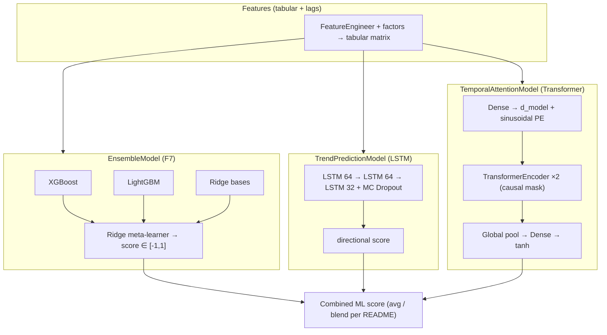

# ML / neural network map (hub)

This note is your **single place in Obsidian** to see how deep learning and the ensemble fit together. Link *from* [[architecture]] and *to* [[experiments]] / [[dataset]] so the **Graph** view shows a real network.

---

## How to *see* it in Obsidian

1. **Open graph (whole vault)**  
   - Left ribbon: **Open graph view** (or `Ctrl+G` / `Cmd+G` on Mac).  
   - You’ll see notes as nodes; lines appear where you used `[[wikilinks]]`.

2. **Local graph (this note only)**  
   - With this file open: click **Open local graph** (often next to the graph icon) to see only notes linked to/from *this* note.

3. **This diagram (flowchart)**  
   - Switch to **Reading** or **Live Preview** (not raw edit) so **Mermaid** renders below.

4. **Optional plugins** (Community → Browse)  
   - **Excalidraw** — sketch architecture by hand.  
   - **Dataview** — tables from frontmatter if you tag experiments.

Obsidian does **not** auto-import Python class diagrams; the map is **markdown + links + Mermaid** (and optional Canvas).

---

## Code ↔ files (where the nets live)

| Piece | File |
|-------|------|
| LSTM + MC Dropout | `src/models/trend_model.py` — `TrendPredictionModel` |
| Transformer (causal, 2 layers) | `src/models/attention_model.py` — `TemporalAttentionModel` |
| XGB + LGB + Ridge stack | `src/models/ensemble_model.py` — `EnsembleModel` |
| Combined ML usage | `src/alpha/meta_model.py` & ensemble wiring (see README L6) |

---

## Mermaid — ML stack (conceptual)

---

## Wikilinks (use these so the graph lights up)

- [[architecture]] — full 15-layer system
- [[experiments]] — what you tried and metrics
- [[dataset]] — data sources and paths

---

## Canvas (optional)

**New note → Canvas** (or core Canvas plugin): drag cards for **Ensemble**, **LSTM**, **Transformer**, and draw arrows between them; paste the same Mermaid in a card for a static snapshot.
